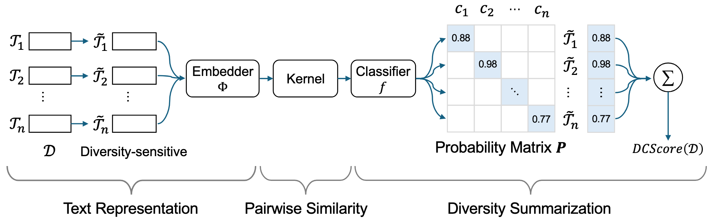

# Measuring Diversity in Synthetic Datasets
## Overview

To evaluate the diversity of synthetic datasets, we propose **DCScore**, a simple yet effective diversity measurement method. DCScore treats the diversity evaluation as a sample classification task, considering mutual relationships among samples. DCScore aims to tackle the LLM-generated dataset diversity evaluation problem. The framework of DCScore is shown as follows.

## Requirements
- transformers
- sentence_transformers
- torch
- numpy
- sklearn

## Run
Run the cell of "demo.ipynb".